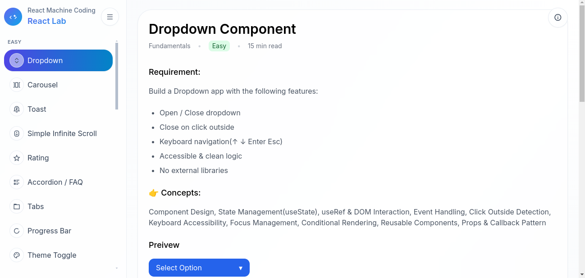

# 🚀 Frontend Machine Coding Hub

A collection of **React machine coding questions & reusable components**  
built for interview preparation and real-world UI practice.

🔗 Live Preview: https://your-demo-link.com  
📦 Tech: React, Hooks, CSS, JavaScript  


## 🧩 Components & Mini Projects

| Component | Category | Time | Concepts | Preview | Code |
|-----------|----------|------|---------|--------|------|
| ⭐ Rating Component | UI Component | 20 min | State, Props |
| 🔍 Search with Debounce | Machine Coding | 30 min | Debounce, API | 
| 📄 Pagination | UI Logic | 25 min | Pagination Logic |
| 📋 Form Validation | Form | 35 min | Validation, Hooks |
| 🎣 Custom Hook | Hooks | 15 min | useFetch | [Live](#) |

---

### ⭐ Rating Component

**Category:** UI Component  
**Time Taken:** 20 mins  
**Concepts:** useState, Events  

**Features:**
- Hover rating
- Click to select
- Reusable component

🔗 Live Demo: https://your-link  
💻 Code: ./components/rating  

## 📸 Preview



## 📁 Folder Structure

src/
 ├── components/
 │    ├── rating
 │    ├── pagination
 │    ├── search
 │
 ├── hooks/
 ├── projects/

## ⚙️ Run Locally

```bash
git clone https://github.com/yourname/repo
cd repo
npm install
npm start


